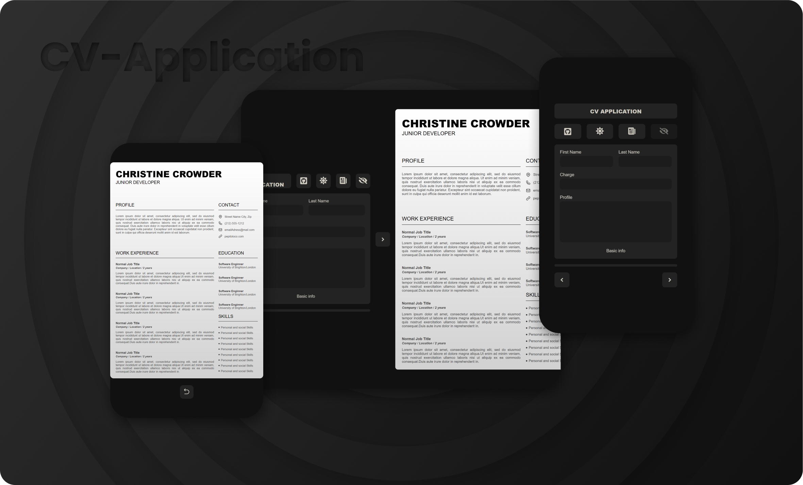
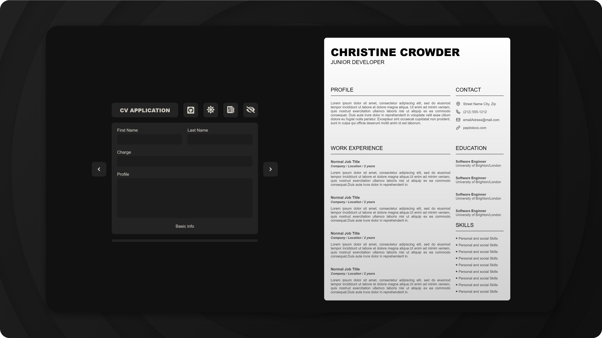

#

<h1 align="center">CV Application</h1>

  CV Application <a href="https://www.theodinproject.com/">The Odin Project</a>

## Demo

👁️ [Live Demo](http://apheiro.github.io/cv_application/)

## Built with

- [React](https://reactjs.org/)
- [Framer Motion](https://www.framer.com/)
- [Auto Animate](https://auto-animate.formkit.com/)
- [pdfMake](https://pdfmake.github.io/docs/0.1/)
- [html2canvas](https://html2canvas.hertzen.com/)
- [react-icons](https://react-icons.github.io/react-icons/)
- [swiper](https://swiperjs.com/)
- [uniqid](https://www.npmjs.com/package/uniqid)

## Features

- Responsive design.
- Clean desing.
- smooth animations.

## Screenshots

